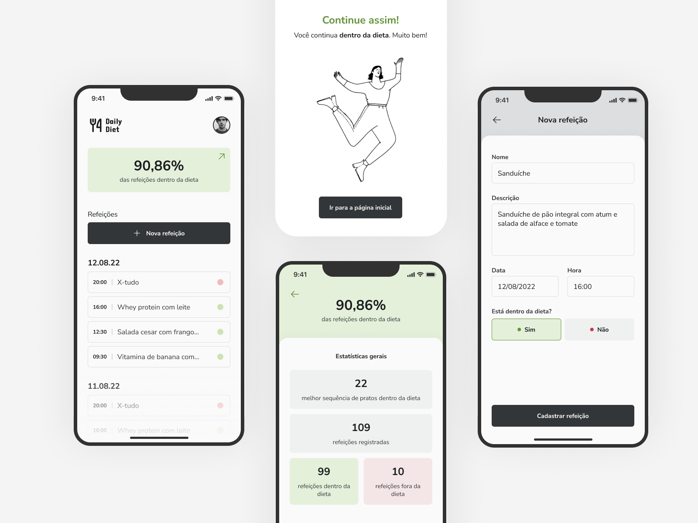

<p align="center">
  
   
  
</p>

<p align="center">
  <a href="#dart-sobre">Sobre</a> &#xa0; | &#xa0;
  <a href="#rocket-tecnologias">Tecnologias</a> &#xa0; | &#xa0;
  <a href="#warning-pré-requisitos"> Pré requisitos</a> &#xa0; | &#xa0;
  <a href="#checkered_flag-começando">Começando</a> &#xa0; | &#xa0;
  <a href="#memo-licença">Licença</a> &#xa0; | &#xa0;
  <a href="https://github.com/geovaneborba" target="_blank">Autor</a>
</p>

<br>

## :dart: Sobre

<p>
  O Daily Diet é uma aplicação mobile projetada para auxiliar os usuários a monitorar e controlar sua dieta alimentar. 
  Além de permitir o registro das refeições, a aplicação oferece a funcionalidade de visualização de estatísticas relacionadas à alimentação, proporcionando uma experiência completa para o usuário.

  Esse desafio faz parte da trilha de React Native Ignite da <a href='https://www.rocketseat.com.br/' target="_blank">Rocketseat</a>.
  Neste desafio, apliquei os conceitos aprendidos nos módulos anteriores:

- Estados
- Navegação com React Navigation
- Estilização com Stlyed Components
- Armazenamento local com AsyncStorage
- Imutabilidade do estado
- Listas e chaves no React Native
- Propriedades
- Componentização
- Parâmetros de navegação

</p>

<p align="right">(<a href="#top">Voltar para o topo</a>)</p>

## :rocket: Tecnologias

As seguintes tecnologias foram usadas na construção do projeto:

- [Expo](https://expo.dev/)
- [React-Native](https://reactnative.dev/)
- [TypeScript](https://www.typescriptlang.org/)
- [Eslint](https://eslint.org/)
- [Prettier](https://prettier.io/)
- [React Hook Form](https://react-hook-form.com/)
- [Yup](https://www.npmjs.com/package/yup)
- [React Navigation](https://reactnavigation.org/)

<p align="right">(<a href="#top">Voltar para o topo</a>)</p>

## :warning: Pré-requisitos

Antes de começar, você precisa ter o [Git](https://git-scm.com) e o [Node](https://nodejs.org/en/) instalados em sua maquina.

<p align="right">(<a href="#top">Voltar para o topo</a>)</p>

## :checkered_flag: Começando

```bash
# Clone este repositório
$ git clone https://github.com/geovaneborba/ignite-daily-diet.git

# Entre na pasta
$ cd ignite-daily-diet

# Instale as dependências
$ npx expo install

# Para iniciar o projeto
$ npx expo start

```

<p align="right">(<a href="#top">Voltar para o topo</a>)</p>

## :memo: Licença

Este projeto está sob licença MIT. Veja o arquivo [LICENSE](LICENSE.md) para mais detalhes.

<p align="right">(<a href="#top">Voltar para o topo</a>)</p>

<p align="center">Feito com ❤️ por <a href="https://github.com/geovaneborba" target="_blank">Geovane Borba</a></p>
